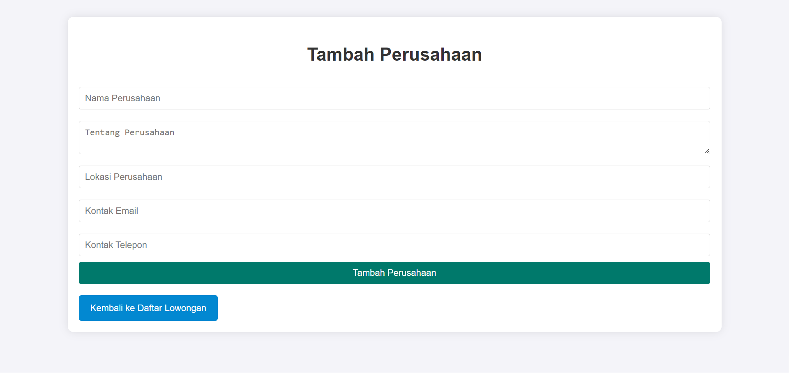

# 📊 Aplikasi Rekomendasi PKL SMK 📋

Selamat datang di **Aplikasi Rekomendasi PKL SMK**! 🎉 
Aplikasi ini dirancang untuk membantu siswa SMK dalam menemukan tempat Program Kerja Lapangan (PKL) yang sesuai dengan keahlian dan minat mereka. Pengguna dapat mencari, melihat informasi, dan mendapatkan rekomendasi tempat PKL berdasarkan jurusan serta perusahaan yang menyediakan lowongan PKL.

## 🚀 Fitur Utama

- **Pencarian dan Rekomendasi Tempat PKL**: Pencarian tempat PKL dapat dilakukan berdasarkan kriteria tertentu, serta rekomendasi berdasarkan jurusan siswa.
- **Manajemen Lowongan PKL**: Perusahaan dapat menambahkan, mengedit, dan mengelola informasi lowongan PKL.
- **Informasi Lengkap Tempat PKL**: Setiap tempat PKL memiliki profil dan informasi lengkap, termasuk kontak perusahaan, deskripsi lowongan, dan syarat yang dibutuhkan.

## 📚 Teknologi yang Digunakan

Proyek ini dibangun menggunakan teknologi berikut:

- **HTML5**: Untuk struktur halaman yang mudah diakses.
- **CSS3**: Untuk desain tampilan aplikasi yang responsif dan menarik.
- **PHP**: Sebagai backend yang mengelola logika aplikasi dan operasi basis data.
- **SQLite**: Sebagai basis data lokal yang menyimpan informasi tempat PKL, detail perusahaan, dan bookmark pengguna.

## 💻 Dokumentasi Halaman

### 1. Halaman Login
Berisi form untuk login dengan memasukkan **Nama Lengkap** dan **Email**.

---

### 2. Halaman Register
Form pendaftaran untuk pengguna baru yang mencakup input **Nama Lengkap**, **Email**, **Nomor Telepon**, dan **Peran** (misalnya, Siswa atau Perusahaan).

---

### 3. Halaman Index Perusahaan
Dashboard perusahaan yang menampilkan **Informasi Perusahaan** dan daftar lowongan PKL yang telah ditambahkan oleh perusahaan.

---

### 4. Halaman Tambah Perusahaan
Formulir untuk menambahkan data perusahaan yang menyediakan lowongan PKL, seperti nama perusahaan, deskripsi, dan kontak.

---

### 5. Halaman Edit Perusahaan
Formulir untuk mengedit data perusahaan yang sudah ada, termasuk informasi perusahaan dan kontak.

---

### 6. Halaman Tambah Lowongan
Formulir untuk menambahkan informasi lowongan PKL baru yang ditawarkan oleh perusahaan, termasuk nama posisi, deskripsi, persyaratan, dan durasi.

---

### 7. Halaman Edit Lowongan
Formulir untuk mengedit data lowongan PKL yang sudah ada, memungkinkan perusahaan memperbarui deskripsi dan persyaratan lowongan.

---

### 8. Halaman Index Siswa
Menampilkan daftar lowongan PKL yang tersedia untuk siswa, dengan detail singkat tentang posisi dan perusahaan.

---

### 9. Halaman Detail Lowongan
Berisi detail lengkap dari lowongan PKL, mencakup **Informasi Perusahaan** dan **Informasi Lowongan** seperti posisi, deskripsi pekerjaan, syarat, dan kontak.

---

## 🔧 Cara Menggunakan

1. **Mendaftar Akun**: Pengguna baru dapat mendaftar dengan mengisi informasi dasar pada halaman Register.
2. **Login**: Setelah mendaftar, pengguna dapat login menggunakan nama lengkap dan email mereka.
3. **Menambahkan Lowongan (Perusahaan)**: Perusahaan dapat menambahkan lowongan baru melalui halaman Tambah Lowongan.
4. **Melihat Daftar Lowongan (Siswa)**: Siswa dapat melihat daftar lowongan yang tersedia pada halaman Index Siswa.
5. **Detail Lowongan**: Klik pada lowongan untuk melihat detail lengkapnya, termasuk deskripsi perusahaan dan informasi kontak.

## 🎯 Tujuan Aplikasi

Aplikasi ini bertujuan untuk mempermudah siswa SMK dalam menemukan tempat PKL yang sesuai, sekaligus membantu perusahaan dalam menyebarkan informasi lowongan yang sesuai dengan kompetensi siswa.

## 🙏 Terima Kasih!

Terima kasih telah menggunakan **Aplikasi Rekomendasi PKL SMK**. Kami berharap aplikasi ini dapat menjadi sarana yang bermanfaat bagi siswa dan perusahaan dalam proses PKL. Jangan lupa untuk memberikan masukan dan feedback agar aplikasi ini dapat terus berkembang! 😊
